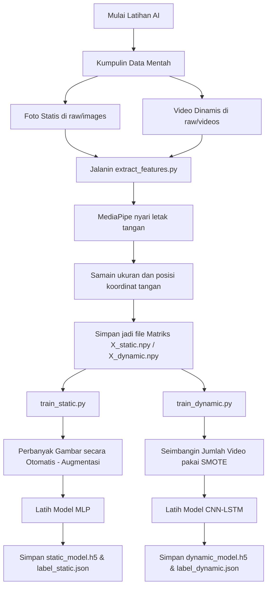

### Projek Bahasa Isyarat Berbasis Computer Vision Menggunakan Google MediaPipe dan TensorFlow

## Dataset
1. Dataset Statis (Huruf dan Angka)
    - Huruf (a-z) -> 8.856 gambar
    - Angka (0-9) -> 3.150 gambar
2. Dataset Dinamis (Kata)
    - 12 kata (Baik, Berapa, Berdiri, Bingung, Dia, Dimana, Duduk, Halo, Mandi, Membaca, Sabar, Selamat) -> 50 video perkata

## Metode Train Model
1. Model Statis (Huruf dan Angka) menggunakan Multilayer Perceptron (MLP)
2. Model Dinamis (Kata) menggunakan Convolutional Neural Network (CNN) dan Long Short-Term Memory (LSTM)

## Struktur Projek
```
[projek CV sign language]/ 
├── Backend/                           
│   ├── data/                                   
│   │   ├── raw/                       
│   │   │   ├── images/                 
│   │   │   └── videos/                 
│   │   └── processed/                 
│   │       ├── static_landmarks/       
│   │       └── dynamic_landmarks/      
│   ├── models/                         
│   │   ├── static_model.h5            
│   │   ├── dynamic_model.h5            
│   │   ├── label_static.json           
│   │   └── label_dynamic.json          
│   ├── src/                            
│   │   ├── config.py                   
│   │   ├── extract_features.py         
│   │   ├── model_architectures.py    
│   │   ├── post_processing.py          
│   │   └── preprocessing.py            
│   ├── api.py                          
│   ├── balance_dataset.py              
│   ├── train_static.py                 
│   ├── train_dynamic.py                
│   └── inference_realtime.py           
│
├── Frontend/                           
│   ├── index.html                      
│   ├── about.html                      
│   ├── dataset_collector.html          
│   ├── learning.html                   
│   ├── prediction_hand.html            
│   ├── assets/                         
│   ├── css/
│   │   └── style.css                   
│   └── js/
│       ├── app.js                      
│       └── hands_detection.js         
│
└── README.md               
```

## Alur Belajar AI



## Teknologi
1. **Google MediaPipe Hands**: Framework machine learning untuk deteksi objek, wajah, dan pose real-time.
2. **TensorFlow**: Platform machine learning open-source berbasis Python dan C++.
3. **FastAPI**: API web Python modern untuk membangun API dengan performa tinggi, berbasis Python 3.6+ berdasarkan standar type hint.
4. **Uvicorn**: Server WSGI open-source yang ringan untuk menjalankan aplikasi web Python.
5. **OpenCV**: Library komputer vision dan machine learning open-source.
6. **NumPy**: Library komputasi numerik open-source untuk Python.
7. **Scikit-learn**: Library machine learning open-source untuk Python.
8. **Imbalanced-learn (SMOTE)**: Library machine learning open-source untuk Python.
9. **HTML5**: Bahasa markup untuk membangun halaman web.
10. **CSS3**: Cascading Style Sheets untuk menata tampilan halaman web.
11. **JavaScript**: Bahasa pemrograman untuk membuat halaman web interaktif.
12. **TailwindCSS**: Framework CSS untuk mempercepat pengembangan tampilan web.


# Alur Kerja projek
**Pengumpulan Data** -> **Pemrosesan Data** -> **Pelatihan Model** -> **Pengujian Model** -> **Implementasi Model** -> **Pengujian Aplikasi**

# Model yang digunakan
1. Model Statis
2. Model Dinamis


## Tampilan Website
# Home

# Prediction

# About

#
